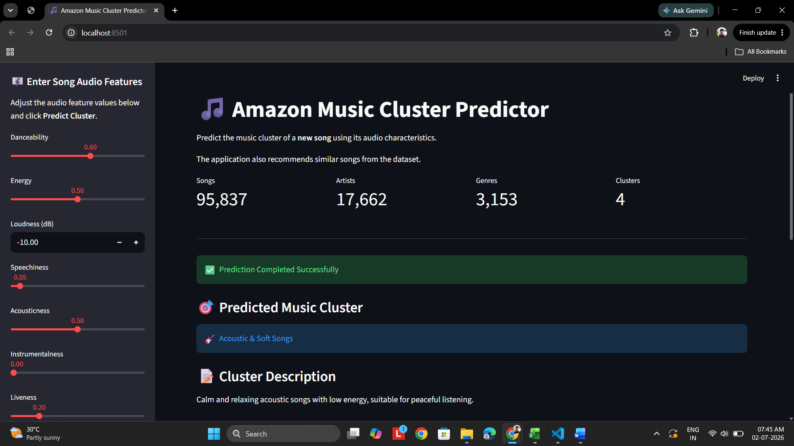
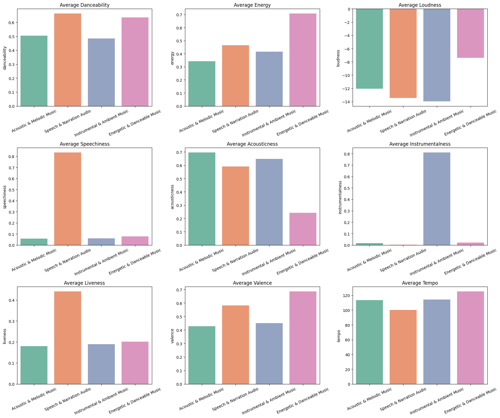
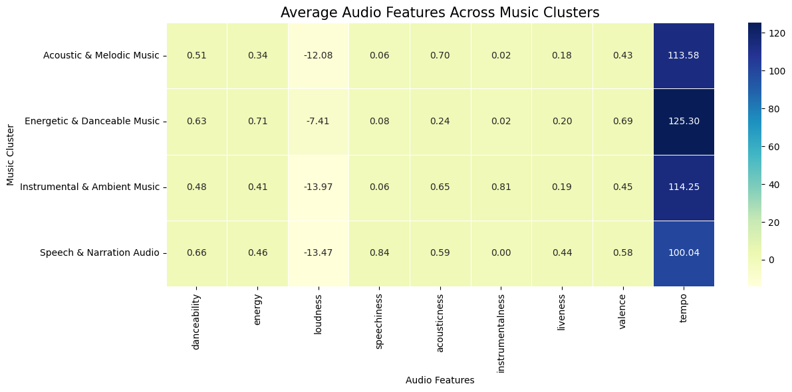
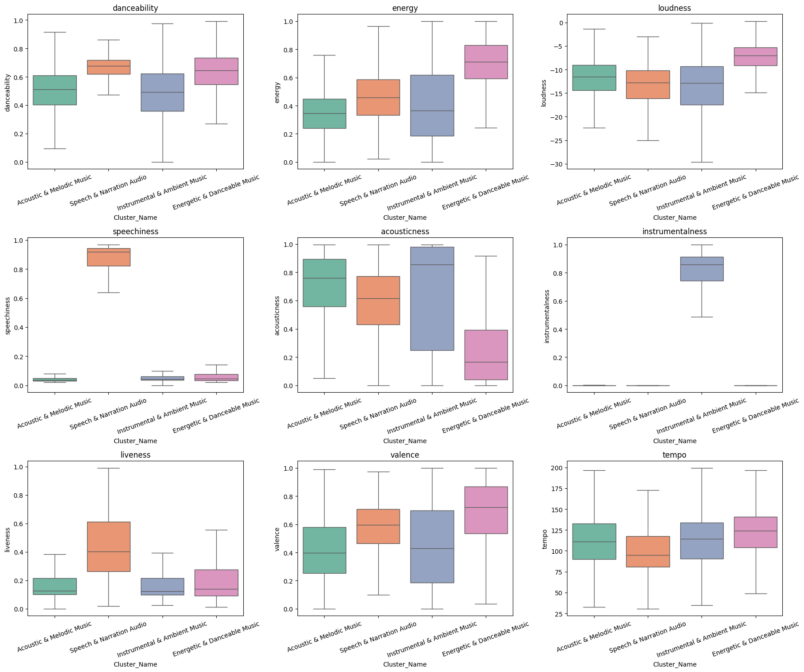
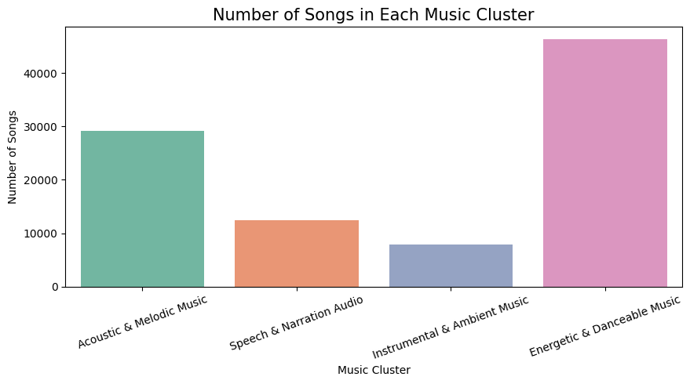
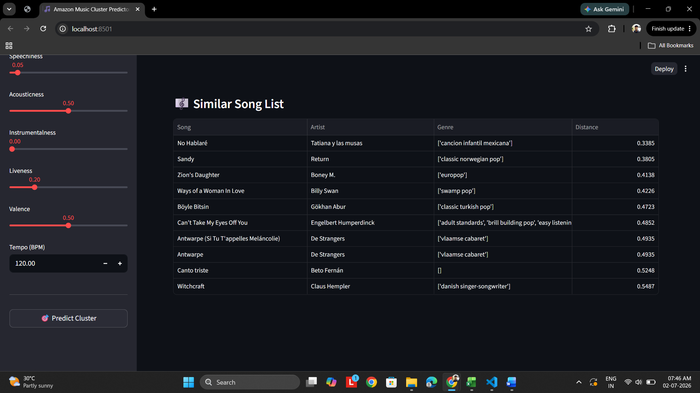

# 🎵 Amazon Music Clustering and Recommendation System

<p align="center">
  
</p>

<p align="center">


</p>

## 📖 Overview

This project applies **K-Means Clustering**, an unsupervised machine learning algorithm, to group **95,837 Amazon Music tracks** based on their audio characteristics.

The clustered songs are then used to build a **content-based music recommendation system**, where users provide audio feature values, and the application predicts the song's cluster before recommending the **Top 10 most similar songs** using **Euclidean Distance**.

A user-friendly **Streamlit web application** has been developed to demonstrate the complete workflow.

---

# 🎯 Objectives

- Perform Exploratory Data Analysis (EDA)
- Select meaningful audio features
- Apply feature scaling using StandardScaler
- Determine the optimal number of clusters
- Train a K-Means clustering model
- Analyze and interpret clusters
- Assign meaningful cluster names
- Visualize clustering results
- Save the trained model using Pickle
- Build a Streamlit web application
- Recommend similar songs using Euclidean Distance

---

# 📂 Dataset Information

| Property | Value |
|-----------|-------|
| Dataset | Amazon Music Dataset |
| Total Songs | **95,837** |
| Total Features | **23** |
| Float Columns | 10 |
| Integer Columns | 7 |
| String Columns | 6 |
| Missing Values | None |
| Duplicate Rows | None |

---

# 🎵 Selected Audio Features

The clustering model uses the following **9 audio features**.

- Danceability
- Energy
- Loudness
- Speechiness
- Acousticness
- Instrumentalness
- Liveness
- Valence
- Tempo

These features describe the musical characteristics of each song.

---

# ⚙️ Feature Scaling

Since the selected features have different ranges, **StandardScaler** was applied before training the model.

### Benefits

- Equal contribution from every feature
- Improved clustering performance
- Better Euclidean distance calculation
- Faster convergence

---

# 📊 Selecting the Optimal Number of Clusters

The optimal number of clusters was evaluated using:

- ✅ Elbow Method (WCSS)
- ✅ Silhouette Score
- ✅ Davies-Bouldin Index (DBI)

## Evaluation Results

| K | WCSS | Silhouette Score | DBI |
|---|---------------:|---------------:|------:|
|2|685950.97|0.2102|1.8692|
|3|573286.79|**0.2494**|1.5169|
|4|507958.11|0.2394|**1.4638**|
|5|464185.95|0.1960|1.6164|
|6|437304.11|0.1691|1.6251|
|7|411371.56|0.1751|1.5432|
|8|387592.12|0.1828|1.5102|
|9|366813.54|0.1828|1.4526|
|10|353306.28|0.1749|1.4732|

### Final Selection

Although **K = 3** achieved the highest Silhouette Score,

**K = 4** was selected because it provides:

- Better cluster interpretation
- Better separation of music styles
- Better overall ranking
- More meaningful recommendations

---

# 🎼 Final Music Clusters

| Cluster | Cluster Name |
|----------|------------------------------|
| 0 | Acoustic & Melodic Music |
| 1 | Energetic & Danceable Music |
| 2 | Speech & Narration Audio |
| 3 | Instrumental & Ambient Music |

Cluster names were assigned after

- Randomly inspecting songs from every cluster
- Comparing average feature values

---

# 📊 Cluster Characteristics

| Cluster | Description |
|----------|-------------|
| 🎵 Acoustic & Melodic Music | High acousticness with calm and melodic songs |
| ⚡ Energetic & Danceable Music | High energy, danceability and loudness |
| 🎤 Speech & Narration Audio | Very high speechiness with spoken-word content |
| 🎹 Instrumental & Ambient Music | High instrumentalness and relaxing ambient tracks |

---

# 📈 Visualizations

## PCA Projection of Clusters

<p align="center">

</p>

Shows the separation of four music clusters after dimensionality reduction using Principal Component Analysis.

---

## Average Feature Comparison

<p align="center">

</p>

Compares the average value of each audio feature across all clusters.

---

## Heatmap

<p align="center">

</p>

Provides an overall comparison of feature values among clusters.

---

## Feature Distribution

<p align="center">

</p>

Displays the distribution of each feature inside every cluster.

---

## Songs per Cluster

<p align="center">

</p>

Shows how songs are distributed across the four identified music clusters.

---

# 💾 Saved Models

The following trained objects are saved using **Pickle**.

- `kmeans_model.pkl`
- `scaler.pkl`

This enables future predictions without retraining.

---

# 💻 Streamlit Web Application

The project includes an interactive **Streamlit application**.

## Home Page

<p align="center">

</p>

Users can

- Enter audio feature values
- Predict music cluster
- View cluster description

---

## Recommendation Page

<p align="center">

</p>

The application

- Displays processed input
- Predicts the cluster
- Filters songs from the predicted cluster
- Calculates Euclidean Distance
- Recommends the Top 10 nearest songs

---

# 🚀 Application Workflow

```
User Input
     │
     ▼
Create DataFrame
     │
     ▼
StandardScaler
     │
     ▼
K-Means Prediction
     │
     ▼
Predict Cluster
     │
     ▼
Filter Songs from Same Cluster
     │
     ▼
Euclidean Distance
     │
     ▼
Top 10 Similar Songs
```

---

# 📁 Project Structure

```
amazon-music-clustering/
│
├── Amazon_Music_EDA_KMeans_Recommendation.ipynb
├── app.py
├── requirements.txt
├── README.md
├── dataset.csv
├── kmeans_model.pkl
├── scaler.pkl
│
├── images/
│   ├── pca_clusters.png
│   ├── feature_barplots.png
│   ├── heatmap.png
│   ├── boxplot.png
│   ├── cluster_distribution.png
│   ├── streamlit_1.png
│   └── streamlit_2.png
│
└── report/
    └── Amazon Music Clustering - Project Report.pdf
```

---

# 🛠️ Technologies Used

- Python
- Pandas
- NumPy
- Matplotlib
- Seaborn
- Scikit-learn
- Streamlit
- Pickle

---

# 📦 Installation

Clone the repository

```bash
git clone https://github.com/yourusername/amazon-music-clustering.git
```

Move into the project

```bash
cd amazon-music-clustering
```

Install dependencies

```bash
pip install -r requirements.txt
```

Run the Streamlit application

```bash
streamlit run app.py
```

---

# 📊 Results

✅ Successfully clustered **95,837 songs**

✅ Identified **4 meaningful music categories**

✅ Built a content-based recommendation engine

✅ Developed an interactive Streamlit web application

✅ Recommends similar songs using Euclidean Distance

---

# 🔮 Future Improvements

- Spotify API integration
- Genre-aware recommendations
- Artist similarity
- Cosine Similarity recommendation
- Deep Learning embeddings
- UMAP visualization
- Cloud deployment

---

# 👨‍💻 Author

**Gopinath S**

B.Tech Leather Technology | Data Science | Machine Learning | Python | Streamlit

📧 Email: *gopinath13107@gmail.com*

🔗 LinkedIn: [https://www.linkedin.com/in/gopinaths](https://www.linkedin.com/in/gopinaths/)

🐙 GitHub: https://github.com/gopinath-sara1n

---

# ⭐ Support

If you found this project useful, please consider giving it a **⭐ Star** on GitHub.

It helps others discover the project and motivates future improvements.

---

## 📜 License

This project is licensed under the **MIT License**.
